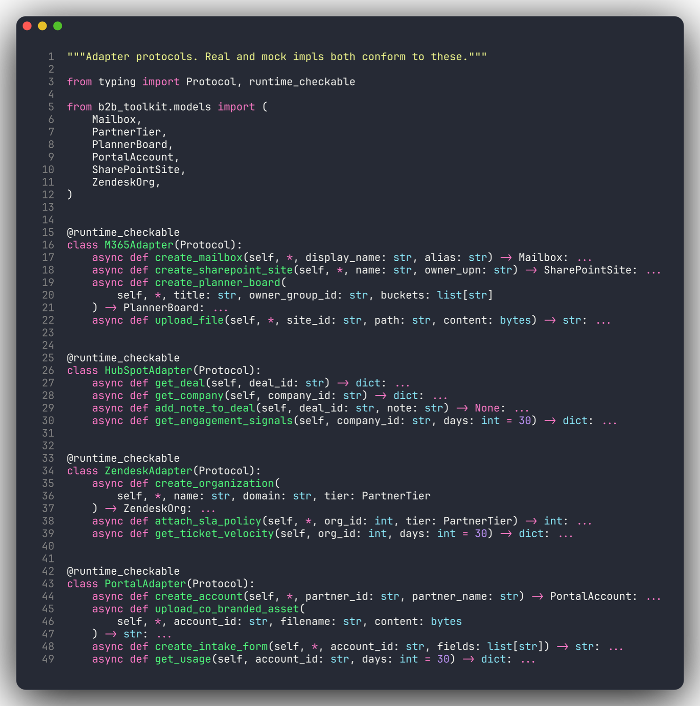
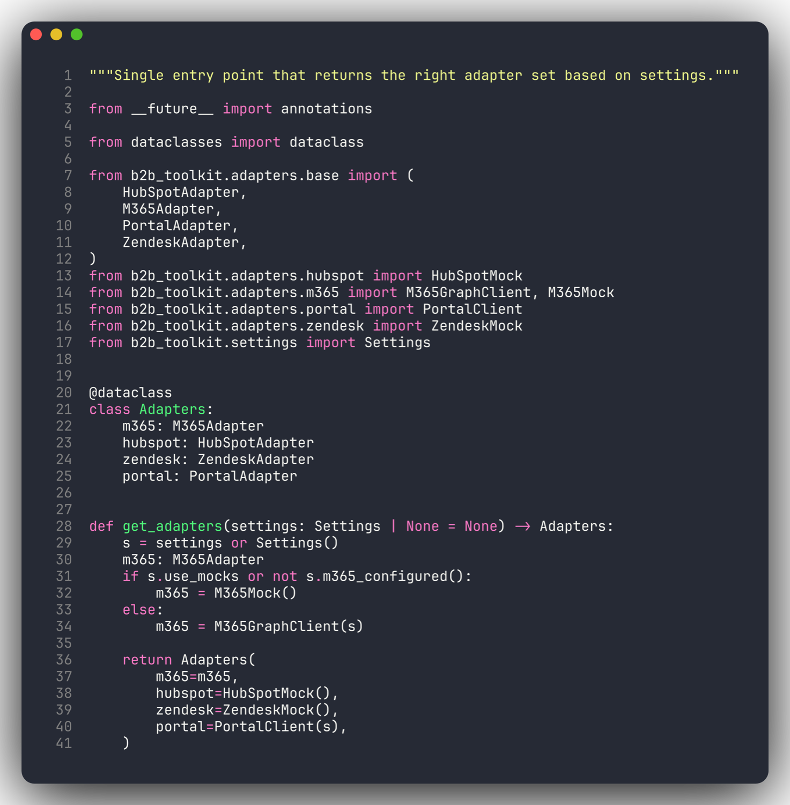

# b2b-agent-toolkit

Reusable Python integration adapters for AI agents that operate against B2B SaaS stacks.

## Agents that use this

| Agent | What it does |
|---|---|
| [partner-onboarding-agent](https://github.com/anthonyonazure/partner-onboarding-agent) | Takes a closed-won HubSpot deal to fully operational in <2 hours: M365 + Zendesk + portal provisioning + co-branded PDF welcome packet |
| [ai-account-manager](https://github.com/anthonyonazure/ai-account-manager) | Always-on revenue co-pilot. Ranks churn / expansion / co-sell signals per account; briefs each AM via Slack DM, Teams channel, and Teams 1:1 DM |
| [compliance-evidence-agent](https://github.com/anthonyonazure/compliance-evidence-agent) | SOC 2 evidence collector. Pulls Entra (CA policies, audit log, role memberships) + Azure Resource Graph; emits a hash-stamped multi-page PDF audit pack |
| [marketing-automation-agent](https://github.com/anthonyonazure/marketing-automation-agent) | B2B cold-outreach with a brand-voice firewall. Per-target enrichment + LLM draft + reviewer pass; lands as drafts in Outlook for human approval |

Works standalone for any LangGraph / LangChain / Anthropic SDK project; the four agents above are reference consumers.

### One small protocol per source — real and mock implementations both conform



### Single entry point — env flag picks real vs mock



## What's in here

| Adapter | Real impl | Mock impl | Notes |
|---|---|---|---|
| Microsoft 365 — provisioning (Graph) | yes | yes | Mailbox, SharePoint, Planner, Drive uploads via app-only auth |
| Microsoft 365 — mailer (Graph) | yes | yes | Creates **drafts** in a sender's mailbox (never sends autonomously) |
| Entra ID audit (Graph) | yes | yes | Conditional access policies, directory audit events, admin role memberships |
| Azure Resource Graph (ARM) | yes | yes | KQL queries against subscription resources + diagnostic settings |
| HubSpot | interface | yes | Deals, companies, engagement signals, deal notes |
| Zendesk | interface | yes | Organizations, tickets, SLA policies, ticket velocity |
| Internal portal | client only | n/a — runs against [mock server](https://github.com/anthonyonazure/partner-onboarding-agent/tree/main/mock_portal) | Speaks the same OpenAPI as the real portal |

Every adapter implements a small `Adapter` protocol so you can swap real ↔ mock with a single env flag (`B2B_USE_MOCKS`). All real implementations are verified end-to-end against a live Microsoft 365 + Azure tenant by the agents listed above.

## Install

```bash
cd b2b-agent-toolkit
python -m venv .venv && source .venv/bin/activate
pip install -e ".[dev]"
cp .env.example .env  # fill in real creds only when you need them
```

## Use

```python
from b2b_toolkit import get_adapters

adapters = get_adapters()  # honors B2B_USE_MOCKS
mailbox = await adapters.m365.create_mailbox(
    display_name="Acme Partners",
    alias="acme-partners",
)
```

## Layout

```
src/b2b_toolkit/
├── settings.py          # pydantic-settings, env-driven config
├── models.py            # Partner, Mailbox, ConditionalAccessPolicy, AuditEvent, ...
├── factory.py           # get_adapters() — picks real vs mock per env
└── adapters/
    ├── base.py          # Protocols (one per adapter)
    ├── m365/            # Real Graph (provisioning) + mock
    ├── m365_mailer/     # Real Graph (drafts) + mock
    ├── entra_audit/     # Real Graph (CA policies, audit log, roles) + mock
    ├── azure_resource/  # Real ARM Resource Graph + mock
    ├── hubspot/
    ├── zendesk/
    └── portal/          # Always real client; the *server* is mocked
```
